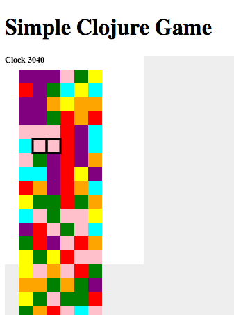

# Simple Clojure Game

Another simple game to practice clojure and clojurescript.

## Usage

    # Install plugins and dependencies based on project.clj
    lein install
    # Compile Clojurescript and crossover code
    lein cljsbuild once
    # Start an HTTP server on port 3000
    lein ring server
    # Navigate to: http://localhost:3000/game.html

## Tests

    lein test attack.test.core attack.test.color attack.test.grid

## Development

    bundle install
    guard

## Browser Repl

    # Starts a server listening on port 9000 which the game page 
    # can communicate with. Run after `lein ring server`
    lein trampoline cljsbuild repl-listen

## Media

* f349bbd - http://youtu.be/pUMlQips6o0
* 1e4683f - http://youtu.be/KoNOEXhocbw
* d6ef2ae - http://youtu.be/w4A6288J2x8

