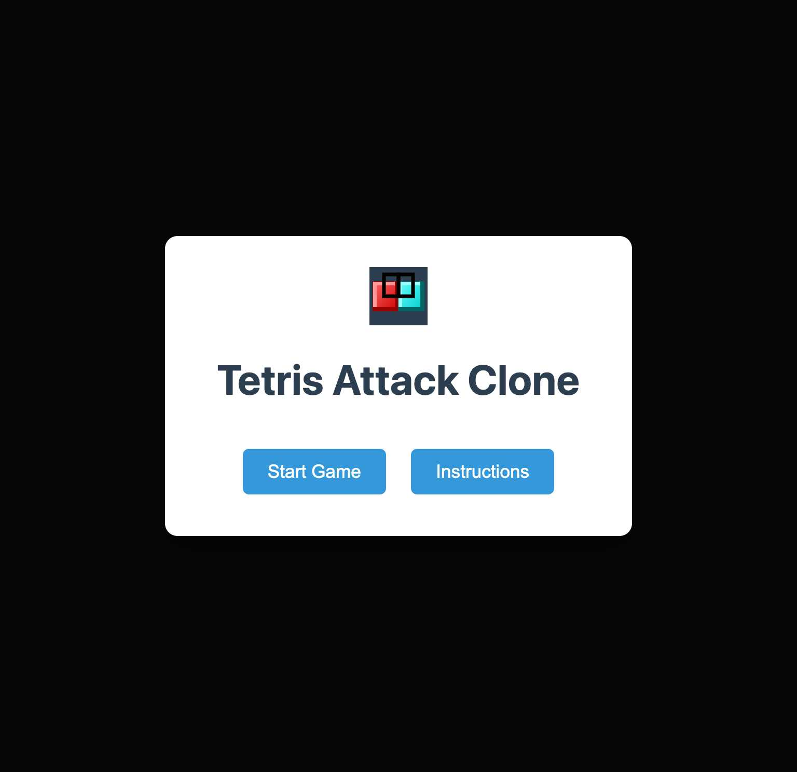
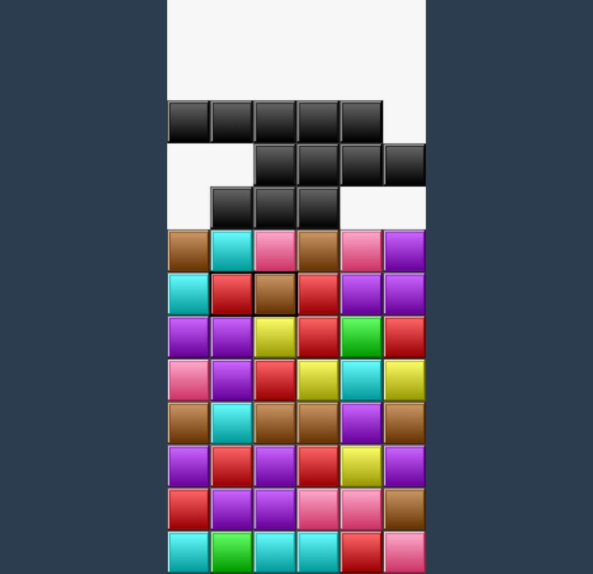
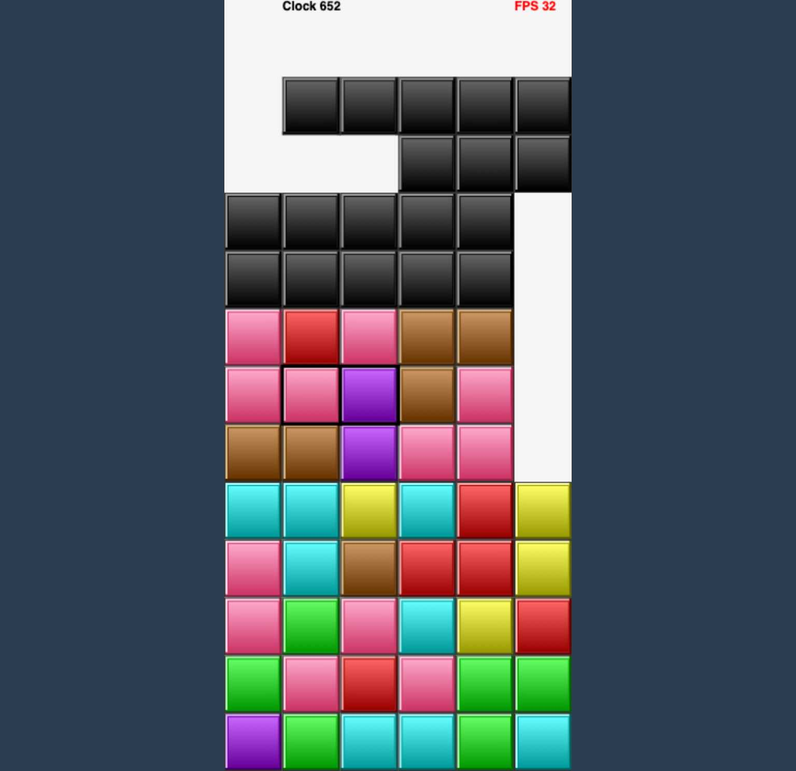
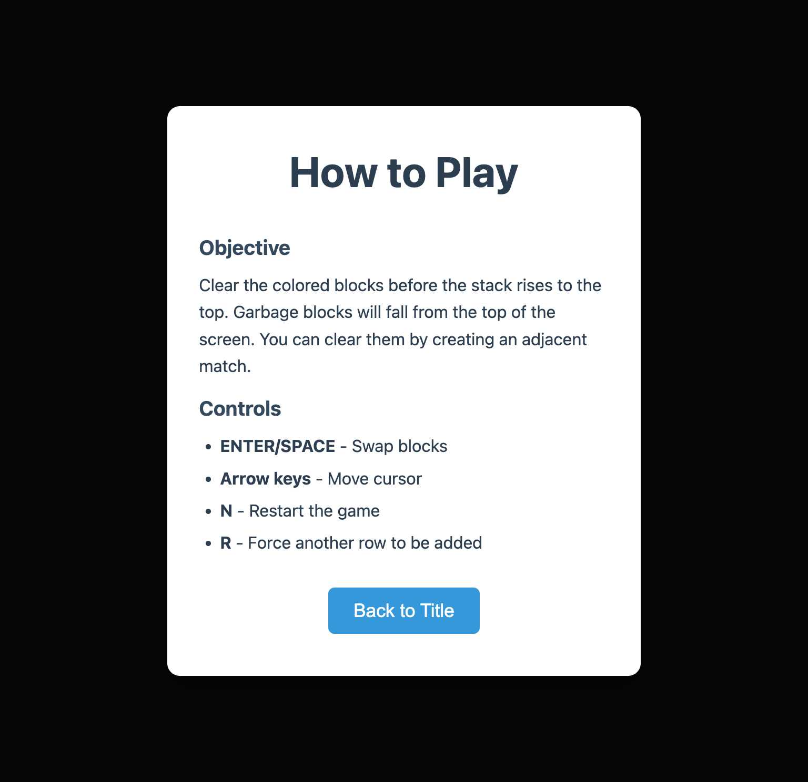

# Tetris Attack Clone

A modern Tetris Attack/Panel de Pon clone implemented in Clojure/ClojureScript with dynamic canvas scaling and responsive design.

## Usage

    brew install mise
    mise install

    # Install dependencies based on deps.edn
    clojure -P

    # Start development server with hot reloading
    npx shadow-cljs watch app
    # Navigate to: http://localhost:8080/
    # Debug mode: http://localhost:8080/?debug (shows FPS and clock)

## Tests

    # Run all tests (180 tests, 588 assertions)
    clojure -M:test
    
    # Alternative test runners
    clojure -M:runner     # Same as :test
    clojure -M:kaocha     # Advanced kaocha features
    
Note: Tests follow standard Clojure naming convention with `-test` suffix for automatic discovery.

## Features

- **Dynamic Canvas Scaling**: Game automatically adapts to any screen size while maintaining aspect ratio
- **Responsive Design**: All game elements scale proportionally with viewport
- **Modern UI**: Clean, borderless interface with seamless page integration
- **Screen System**: Title screen, instructions, and game over screens
- **Debug Mode**: Optional FPS and clock display with `?debug` query parameter
- **Comprehensive Testing**: 176+ tests with 576+ assertions covering game mechanics

## Game Controls

- **ENTER/SPACE**: Swap blocks
- **Arrow keys**: Move cursor
- **N**: Restart the game
- **R**: Force another row to be added

## Browser Repl

    # Connect to the shadow-cljs browser REPL
    npx shadow-cljs browser-repl
    
    # Or use the shadow-cljs UI
    npx shadow-cljs cljs-repl app

## Screenshots

### Title Screen

### Gameplay 

### Debug Mode (with FPS and Clock)

### Instructions Screen

### Game Over Screen

## Historical Videos

* 89aad03 - http://youtu.be/wasgwLAFmwY
* 27463f8 - http://youtu.be/WWK8RFEY04I
* 0a9ca69 - http://youtu.be/t9HijqwaZbs
* 2ed0943 - http://youtu.be/5W6ntRg5AjE
* 16c6402 - http://youtu.be/CuqilytlfJE
* 391bb24 - http://youtu.be/wai3ft4yHl8
* f349bbd - http://youtu.be/pUMlQips6o0
* 1e4683f - http://youtu.be/KoNOEXhocbw
* d6ef2ae - http://youtu.be/w4A6288J2x8

