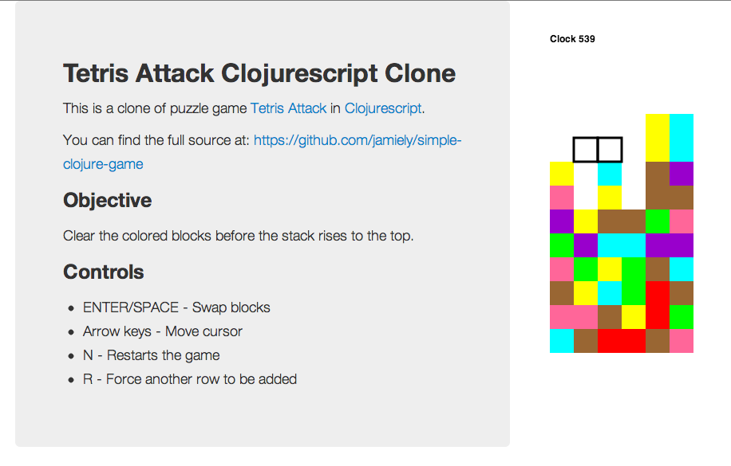
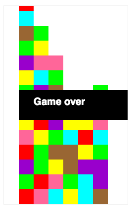

# Simple Clojure Game (Tetris Attack/Panel de Pon Clone)

A game to practice clojure and clojurescript. Only works in Chrome.

## Usage

    brew install mise
    mise install

    # Install dependencies based on deps.edn
    clojure -P

    # Start development server with hot reloading
    npx shadow-cljs watch app
    # Navigate to: http://localhost:8080/game.html

## Tests

    # Run all tests (180 tests, 588 assertions)
    clojure -M:test
    
    # Alternative test runners
    clojure -M:runner     # Same as :test
    clojure -M:kaocha     # Advanced kaocha features

## Browser Repl

    # Connect to the shadow-cljs browser REPL
    npx shadow-cljs browser-repl app
    
    # Or use the shadow-cljs UI
    npx shadow-cljs server

## Media

* 89aad03 - http://youtu.be/wasgwLAFmwY
* 27463f8 - http://youtu.be/WWK8RFEY04I
* 0a9ca69 - http://youtu.be/t9HijqwaZbs
* 2ed0943 - http://youtu.be/5W6ntRg5AjE
* 16c6402 - http://youtu.be/CuqilytlfJE
* 391bb24 - http://youtu.be/wai3ft4yHl8
* f349bbd - http://youtu.be/pUMlQips6o0
* 1e4683f - http://youtu.be/KoNOEXhocbw
* d6ef2ae - http://youtu.be/w4A6288J2x8

